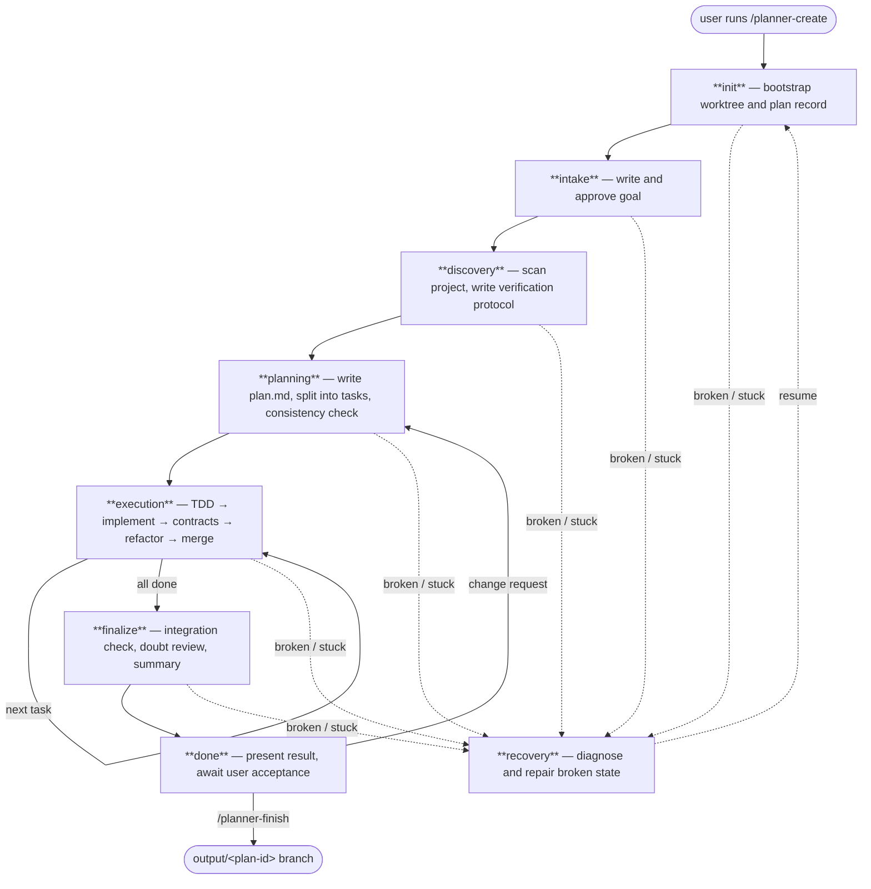

> ⚠️ Experimental. pi-code-planner is built **for local coding models** and, at runtime, is driven by one — a small local model (tested with Qwen3.6-35B-A3B-UD-Q4_K_XL.gguf) running through Pi. Cloud LLMs (such as Claude) take part in its development. It is maintained with AI assistance and may contain non-professional design choices, rough edges, broken behavior, or mistakes. Use it at your own risk.

# pi-code-planner

<p align="center">
  
</p>

An experimental [Pi](https://github.com/badlogic/pi-mono) extension for local coding models. Adds a persisted state machine so long tasks survive context compaction, Git branching, and user approval steps without babysitting the session.

> Not a guarantee of better output. In practice, a session implementing a nontrivial feature ran about 3 hours untouched. That is the goal.

---

## Install

Released versions, published to npm:

```bash
pi install npm:pi-code-planner
```

Developer version — the latest `main`, including changes not yet released to npm:

```bash
pi install git:github.com/m62624/pi-code-planner
```

Both channels can have bugs; the difference is only what they track — npm follows tagged releases, GitHub follows `main`. Pick npm for released versions and GitHub to try the newest changes.

Open Pi inside a Git project and run `/planner-create`.

> If `Shift+Enter` doesn't insert a new line, add `"tui.input.newLine": ["ctrl+j"]` to `~/.pi/agent/keybindings.json` and run `/reload`.

---

## How it works



**Runs on its own** through init, discovery, planning, execution, and finalize.

**Stops and waits for you** at two moments:
- **intake** — approves the goal before planning starts
- **done** — waits for `/planner-finish` or a correction

| Stage | Who drives it |
| --- | --- |
| init | Automated |
| intake | **You approve the goal** |
| discovery | Automated |
| planning | Automated |
| execution | Automated (repeated per task) |
| finalize | Automated |
| done | **You run `/planner-finish`** |
| recovery | Automated, may ask before destructive repairs |

---

## Settings

See [SETTINGS.md](SETTINGS.md) for the full reference.

**Idle watchdog** (`idle.timeoutMinutes`) — wakes the model when it goes silent mid-step.

The watchdog sends a wake-up message when the model has made no planner tool call for `timeoutMinutes`. This handles the common case where the model pauses mid-step — a long inference, a generation that produced prose instead of a tool call, or a context edge case. The wake message tells it to call `planner_status` and continue from the persisted state.

The right value depends on your model's inference speed. If the timeout is too short, the watchdog fires during normal generation and interrupts a step in progress. Too long, and a genuinely stuck model sits idle for a long time before recovery.

| Speed | Recommended |
| --- | --- |
| < 5 tok/s | `20` |
| 5–15 tok/s | `15` |
| 15–30 tok/s | `10` |
| > 30 tok/s | `6` |

> `timer.syncIntervalMinutes` is separate — it only controls how often the TUI clock saves telemetry, it does not wake the model.

---

## Commands

| Command | Purpose |
| --- | --- |
| `/planner-create` | Create a new plan from a request |
| `/planner-resume` | Resume an existing plan |
| `/planner-finish` | Export result, clean up state |
| `/planner-dashboard` | Open the live stage dashboard |
| `/planner-improve` | Discovery-first self-improvement plan |
| `/planner-skills` | Search and manage planner-generated skills |
| `/planner-exit` | Return to the original session without finishing |
| `/planner-delete` | Delete a plan |
| `/planner-rename` | Rename a plan |
| `/planner-helper` | Show current effective settings |

---

## Git Branches

```
base → plan/<plan-id> → task/<plan-id>/<task-id> → output/<plan-id>
```

Raw `git` is blocked while a plan is active. Use planner Git wrappers. Run tests from the worktree path reported by `planner_status`.

---

## Development

```bash
git clone https://github.com/m62624/pi-code-planner.git
cd pi-code-planner
npm install
npm run build
pi -e ./src/index.ts
```

---

## Why local, and what this actually does

This section is the reasoning behind the project, not a feature list. Read it before deciding whether the trade is worth it for you.

**The model is the bottleneck, and this extension does not change that.** It adds no intelligence, no extra reasoning, no fine-tuning. A small local model stays exactly as capable as it was. What changes is the *shape* of the work it is allowed to do.

**Why the focus on local models.** Local and mid-size models behave well on small, localized edits: a function, a file, a change whose entire context fits in the window at once. They degrade on medium and large codebases for a structural reason, not a knowledge one — there is no stable global picture. The relevant facts do not fit in context together; they drift across compaction; a decision made in step 3 is silently contradicted in step 9; "done" gets declared while half the plan is unbuilt. The failure mode is rarely a wrong line of code. It is loss of coherence over distance — across files, across time, across compaction boundaries.

**So the extension is built around boundaries, not cleverness.** Each stage exists to remove one degree of freedom the model would otherwise get wrong:

- **Persisted state machine** — the plan, tasks, decisions, and current step live in JSON/Markdown on disk, not in chat. Compaction can wipe the window; the state survives. The model reconstructs from artifacts via `planner_status`, not from memory.
- **Forced stage/step order** — you cannot implement before discovery, cannot write production code before tests, cannot declare done with pending tasks. The order is enforced by a guard, so a model that "feels finished" early is still held to the protocol.
- **Per-task Git isolation** — one task, one branch, one merge. A bad task is contained instead of smearing across the whole change.
- **Local contracts (AGENTS.md)** — scope is pinned to the relevant directory chain, so the model is told where the edges are instead of guessing and wandering.
- **Mechanical consistency check (elenchus)** — the part a model is *worst* at. Models state individual facts well but cannot hold a long chain of interacting conditions without quietly contradicting themselves. The `planner_elenchus_check` tool moves that chain out of the model: the model states only facts and first principles in a tiny DSL, and a three-valued SAT engine (shipped as wasm, version-locked) does the inference and reports `CONSISTENT / WARNING / UNDERDETERMINED / CONFLICT` with the exact premises to blame. The model can only be wrong at the premise level — and that is caught immediately. It runs as a **soft gate** at `planning/consistency_check` (with availability in discovery, doubt review, and recovery) and always has a `not_applicable` escape, so it never traps linear work that has no interacting constraints to check.

**Honest expectation.** Output quality tracks the clarity of the request far more than the structure does. A vague task ("make it better") gives the structure nothing to hold onto, and the overhead — stage transitions, task splits, test-first loops — can make the result *worse* than a single freewheeling prompt. A precise task with testable acceptance criteria gives the structure something to enforce, and the same weak model can stay on rails for hours and produce something it could not hold together unstructured. It is a trade: you pay in protocol overhead and the risk of a bad task split, and you buy coherence over distance. Sometimes that pays off and sometimes it does not. The goal is not a better model — it is a weak model that does not lose the thread on work too large to fit in its head at once.

## License

[MIT](https://github.com/m62624/pi-code-planner/blob/main/LICENSE)
