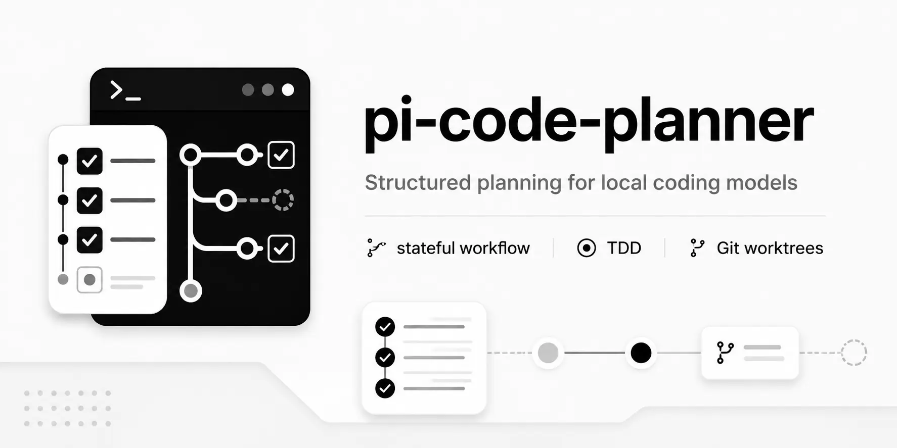

<p align="center">
  
</p>

# pi-code-planner

<p align="center">
  
</p>

An experimental [Pi](https://github.com/badlogic/pi-mono) extension for local coding models. Adds a persisted state machine so long tasks survive context compaction, Git branching, and approval steps without you babysitting the session.

Tested with [Qwen3.6-35B-A3B-UD-Q4_K_XL.gguf](https://huggingface.co/unsloth/Qwen3.6-35B-A3B-GGUF). The model still makes mistakes — sometimes it spirals on a wrong hypothesis, sometimes it misreads the persisted state. But the failure mode changes: instead of silently drifting, it tends to get stuck in a visible way and either self-corrects or calls `planner_report_stuck`. In practice, a session implementing a nontrivial feature went about 3 hours without me touching it. That is the goal.

---

## Install

```bash
pi install npm:pi-code-planner
```

Or from source:

```bash
pi install git:github.com/m62624/pi-code-planner
```

Open Pi inside a Git project and run `/planner-create`.

> If `Shift+Enter` doesn't insert a new line in the editor, add `"tui.input.newLine": ["ctrl+j"]` to `~/.pi/agent/keybindings.json` and run `/reload`.

---

## Workflow

```
user request
  → normalize and approve goal
  → scan AGENTS.md contracts, inspect relevant files
  → persist discovery.md
  → write plan.md, split into tasks
  → for each task: write tests → implement → update AGENTS.md contracts → refactor → verify → merge
  → verify integrated plan branch
  → doubt_review: prove or disprove possible errors
  → ask user to accept
  → export output/<plan-id> branch with full task history
```

After compaction, the model calls `planner_status`, reloads from persisted JSON/Markdown artifacts, and continues. Chat is not the source of truth — artifacts are.

---

## Commands

| Command | Purpose |
| --- | --- |
| `/planner-create` | Create a new plan from a multiline request. |
| `/planner-improve` | Discovery-first self-improvement plan. |
| `/planner-preview` | Check out the plan branch in your main repo to browse accumulated files. Run again for status. `/planner-finish` restores your branch automatically. |
| `/planner-resume` | Pick a plan and resume its worktree session. |
| `/planner-helper` | Show current effective settings and planner behavior. |
| `/planner-skills` | Search, view, and delete planner-generated skills. |
| `/planner-finish` | Export `output/<plan-id>`, remove temporary planner state, return Pi to the original session. |
| `/planner-exit` | Return to the original session without finishing or deleting the plan. |
| `/planner-delete` | Delete a plan after confirmation. |
| `/planner-rename` | Rename a plan title. |

---

## Git Branches

```
base → plan/<plan-id> → task/<plan-id>/<task-id> → output/<plan-id>
```

Each plan owns one isolated worktree and one protected plan branch. Temporary task branches are removed after merge. Output branch keeps the full commit history from all tasks.

While a plan is active, raw `git` is blocked. Use planner Git wrappers. Run tests and builds from the worktree path reported by `planner_status`.

---

## Settings

Optional settings files:

```
getAgentDir()/extensions/pi-code-planner/settings.json
<project-root>/.pi/pi-code-planner/settings.json
```

Example:

```json
{
  "worktree": { "mode": "custom", "root": "/mnt/fast/pi-worktrees" },
  "compact": { "stage": true, "task": false },
  "idle": { "enabled": true, "timeoutMinutes": 10 },
  "metadata": { "humanLanguage": "English" },
  "timer": { "enabled": true, "mode": "status" },
  "contracts": { "enabled": true, "finalPolicy": "ask" }
}
```

| Setting | Default | Purpose |
| --- | --- | --- |
| `worktree.mode` | `"project-local"` | `"project-local"` stores under `<project-root>/.pi/pi-code-planner/worktrees/`. `"custom"` uses `worktree.root`. |
| `compact.stage` | `true` | Compact at stage boundaries. |
| `compact.task` | `false` | Compact at task boundaries. |
| `idle.enabled` | `true` | Idle watchdog — sends a follow-up when the model goes quiet for `timeoutMinutes`. |
| `idle.timeoutMinutes` | `10` | Inactivity threshold before the watchdog fires. |
| `timer.mode` | `"status"` | `"status"` = one footer line. `"widget"` = passive block above editor. |
| `metadata.humanLanguage` | `"English"` | Language for user-facing generated text (summaries, titles, doubt review). |
| `contracts.enabled` | `true` | Enable AGENTS.md contract discovery, routing, checks, and upserts. |
| `contracts.finalPolicy` | `"ask"` | What `/planner-finish` does with planner AGENTS.md changes: `"ask"`, `"keep"`, or `"remove"`. |

Settings merge: defaults → global → project. `worktree` and `compact` are captured at plan creation and don't change mid-plan.

---

## AGENTS.md Contracts

The planner treats `AGENTS.md` files as local architecture contracts — durable model-facing memory that routes the model through the project without reading irrelevant code first. Inspired by [DOX](https://github.com/agent0ai/dox).

Contracts are written only through `planner_contract_upsert`. The planner tracks touched files in `state.json` and keeps baselines so `/planner-finish` can remove or restore them.

---

## Development

```bash
git clone https://github.com/m62624/pi-code-planner.git
cd pi-code-planner
npm install
npm run build
pi -e ./src/index.ts
```

---

## License

[MIT](https://github.com/m62624/pi-code-planner/blob/main/LICENSE)
