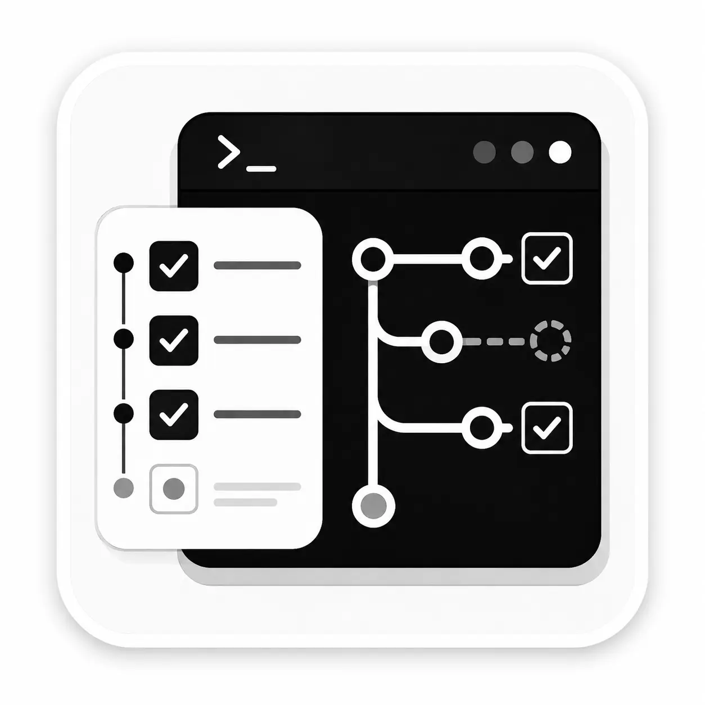
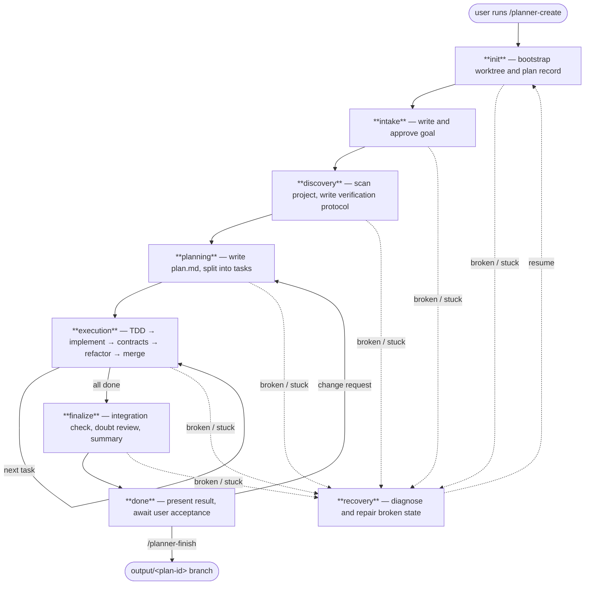

> ⚠️ Experimental. pi-code-planner is built **for local coding models** and, at runtime, is driven by one — a small local model (tested with Qwen3.6-35B-A3B-UD-Q4_K_XL.gguf) running through Pi. Cloud LLMs (such as Claude) take part in its development. It is maintained with AI assistance and may contain non-professional design choices, rough edges, broken behavior, or mistakes. Use it at your own risk.

# pi-code-planner

<p align="center">
  
</p>

An experimental [Pi](https://github.com/badlogic/pi-mono) extension for local coding models. Adds a persisted state machine so long tasks survive context compaction, Git branching, and user approval steps without babysitting the session.

> Not a guarantee of better output. In practice, a session implementing a nontrivial feature ran about 3 hours untouched. That is the goal.

---

## Install

```bash
pi install npm:pi-code-planner
```

Or from source:

```bash
pi install git:github.com/m62624/pi-code-planner
```

Open Pi inside a Git project and run `/planner-create`.

> If `Shift+Enter` doesn't insert a new line, add `"tui.input.newLine": ["ctrl+j"]` to `~/.pi/agent/keybindings.json` and run `/reload`.

---

## How it works



**Runs on its own** through init, discovery, planning, execution, and finalize.

**Stops and waits for you** at two moments:
- **intake** — approves the goal before planning starts
- **done** — waits for `/planner-finish` or a correction

| Stage | Who drives it |
| --- | --- |
| init | Automated |
| intake | **You approve the goal** |
| discovery | Automated |
| planning | Automated |
| execution | Automated (repeated per task) |
| finalize | Automated |
| done | **You run `/planner-finish`** |
| recovery | Automated, may ask before destructive repairs |

---

## Settings

See [SETTINGS.md](SETTINGS.md) for the full reference.

**Idle watchdog** (`idle.timeoutMinutes`) — wakes the model when it goes silent mid-step.

The watchdog sends a wake-up message when the model has made no planner tool call for `timeoutMinutes`. This handles the common case where the model pauses mid-step — a long inference, a generation that produced prose instead of a tool call, or a context edge case. The wake message tells it to call `planner_status` and continue from the persisted state.

The right value depends on your model's inference speed. If the timeout is too short, the watchdog fires during normal generation and interrupts a step in progress. Too long, and a genuinely stuck model sits idle for a long time before recovery.

| Speed | Recommended |
| --- | --- |
| < 5 tok/s | `20` |
| 5–15 tok/s | `10` |
| 15–30 tok/s | `5` |
| > 30 tok/s | `3` |

> `timer.syncIntervalMinutes` is separate — it only controls how often the TUI clock saves telemetry, it does not wake the model.

---

## Commands

| Command | Purpose |
| --- | --- |
| `/planner-create` | Create a new plan from a request |
| `/planner-resume` | Resume an existing plan |
| `/planner-finish` | Export result, clean up state |
| `/planner-dashboard` | Open the live stage dashboard |
| `/planner-improve` | Discovery-first self-improvement plan |
| `/planner-skills` | Search and manage planner-generated skills |
| `/planner-exit` | Return to the original session without finishing |
| `/planner-delete` | Delete a plan |
| `/planner-rename` | Rename a plan |
| `/planner-helper` | Show current effective settings |

---

## Git Branches

```
base → plan/<plan-id> → task/<plan-id>/<task-id> → output/<plan-id>
```

Raw `git` is blocked while a plan is active. Use planner Git wrappers. Run tests from the worktree path reported by `planner_status`.

---

## Development

```bash
git clone https://github.com/m62624/pi-code-planner.git
cd pi-code-planner
npm install
npm run build
pi -e ./src/index.ts
```

---

## License

[MIT](https://github.com/m62624/pi-code-planner/blob/main/LICENSE)
