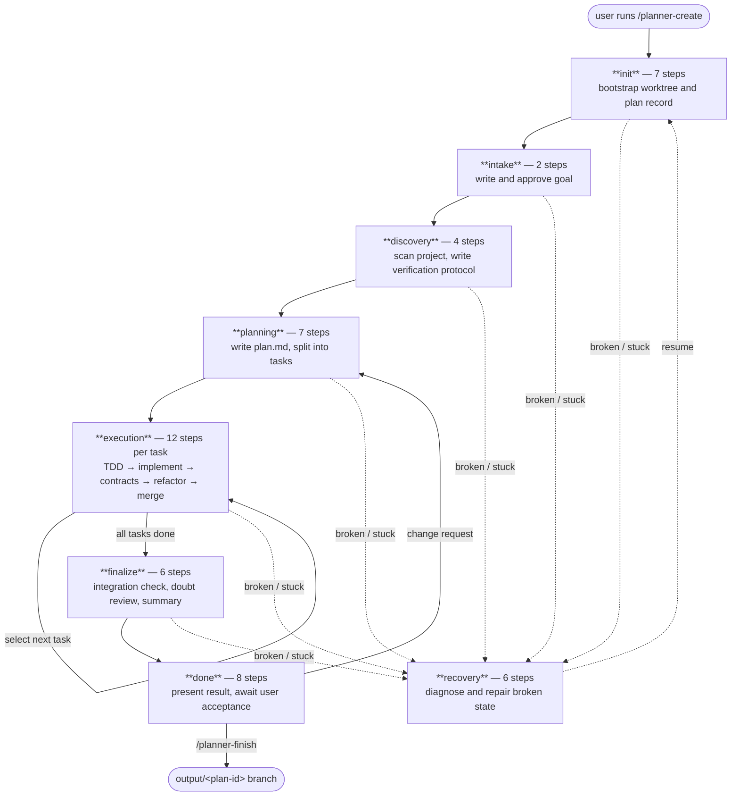

> ⚠️ Experimental. pi-code-planner is built **for local coding models** and, at runtime, is driven by one — a small local model (tested with Qwen3.6-35B-A3B-UD-Q4_K_XL.gguf) running through Pi. Cloud LLMs (such as Claude) take part in its development. It is maintained with AI assistance and may contain non-professional design choices, rough edges, broken behavior, or mistakes. Use it at your own risk.

# pi-code-planner

<p align="center">
  
</p>

An experimental [Pi](https://github.com/badlogic/pi-mono) extension for local coding models. Adds a persisted state machine so long tasks survive context compaction, Git branching, and user approval steps without you babysitting the session.

However you run it, the unit that matters is **Pi + this extension driving a local model**. With that in mind, read this plainly:

> This is not a guarantee of better output. The extension can make results worse by adding overhead or constraining the model at the wrong time. It is an experiment, not a stable product.

Tested with [Qwen3.6-35B-A3B-UD-Q4_K_XL.gguf](https://huggingface.co/unsloth/Qwen3.6-35B-A3B-GGUF). The model still makes mistakes — sometimes it spirals on a wrong hypothesis, sometimes it misreads the persisted state. But the failure mode changes: instead of silently drifting, it tends to get stuck in a visible way and either self-corrects or calls `planner_report_stuck`. In practice, a session implementing a nontrivial feature went about 3 hours without me touching it. That is the goal.

---

## Install

```bash
pi install npm:pi-code-planner
```

Or from source:

```bash
pi install git:github.com/m62624/pi-code-planner
```

Open Pi inside a Git project and run `/planner-create`.

> If `Shift+Enter` doesn't insert a new line in the editor, add `"tui.input.newLine": ["ctrl+j"]` to `~/.pi/agent/keybindings.json` and run `/reload`.

---

## State Machine Overview

The extension drives the model through a fixed sequence of stages. Each stage contains a set of steps. The model cannot skip stages, call out-of-order tools, or advance past a gate without satisfying its exit conditions.



The model never touches the diagram directly — it only ever calls the tool for the current step, and the gate advances the pointer.

---

## Stages and Steps

52 steps total across 8 stages.

### init — 7 steps

Runs once when `/planner-create` is called. Fully automated — the model does not drive these steps.

| Step | What happens |
| --- | --- |
| `check_project` | Verify a Git repo exists |
| `check_git` | Ensure Git is usable; init if needed |
| `prepare_storage` | Create `.pi/pi-code-planner/` storage directories |
| `choose_worktree_location` | Select worktree path |
| `create_plan_record` | Write `plan.json` and `project.json` |
| `create_plan_worktree` | `git worktree add` for the plan branch |
| `enter_intake` | Transition to intake stage |

### intake — 2 steps

The model reads the user's request and writes a normalized goal. The user must approve before planning begins.

| Step | What happens |
| --- | --- |
| `draft_goal` | Model writes `goal.md` via `planner_goal_submit` |
| `await_goal_approval` | Model presents goal; user approves or revises via `planner_goal_decide` |

### discovery — 4 steps

The model scans the project, reads contracts, and produces a `discovery.md` artifact that persists across all future compactions.

| Step | What happens |
| --- | --- |
| `scan_project_structure` | Read files, AGENTS.md contracts, run checks; write `discovery.md` with a **Verification Protocol** (exact commands to prove work is correct) |
| `write_questions` | Write and resolve open questions in `questions.md` |
| `compact_discovery` | Compact checkpoint — Pi compacts context here |
| `enter_planning` | Transition to planning stage |

The **Verification Protocol** is critical: it locks down the exact commands (`cargo test`, `npm run ci`, etc.) that every `doubt_review` submission must prove passed. The parser enforces this — if a command is missing from evidence, the submission is blocked.

### planning — 7 steps

The model writes a plan and splits it into atomic tasks. Each task gets its own `task.md` artifact.

| Step | What happens |
| --- | --- |
| `read_context` | Route AGENTS.md contracts relevant to the goal |
| `draft_plan` | Write `plan.md` via `planner_plan_submit` |
| `split_tasks` | Identify atomic tasks from the plan |
| `write_task_files` | Write each `task.md` via `planner_task_upsert` |
| `verify_plan` | Self-check: all tasks have acceptance criteria and scope |
| `compact_planning` | Compact checkpoint |
| `enter_execution` | Transition to execution stage |

### execution — 12 steps (repeated per task)

The main loop. Each task cycles through all 12 steps before the next task begins.

| Step | What happens |
| --- | --- |
| `prepare_task` | Create `task/<plan-id>/<task-id>` branch via `planner_git_create_task_branch` |
| `write_tdd_plan` | Write pre-implementation TDD plan: failing signal, production path, success signal |
| `write_tests` | Write or locate tests; commit via `planner_git_commit` |
| `run_failing_tests` | Verify tests fail (or exist) before implementation |
| `implement_task` | Implement; commit incrementally |
| `contract_check` | Assess AGENTS.md impact; upsert contracts if needed |
| `refactor_task` | Review changed surface for complexity and naming |
| `run_final_tests` | Run full verification protocol; tests must pass |
| `capture_skill` | Record reusable technique in skill library if warranted |
| `merge_task_to_plan` | Merge task branch into plan branch via `planner_git_merge_task_to_plan` |
| `compact_task` | Compact checkpoint |
| `select_next_task` | Pick next pending task or exit to finalize |

### finalize — 6 steps

Integration check and adversarial review of the complete plan branch before presenting to the user.

| Step | What happens |
| --- | --- |
| `verify_plan_branch` | Run full test suite on the merged plan branch |
| `compact_before_doubt` | Compact checkpoint — doubt review starts with a clean context |
| `doubt_review` | Adversarial audit via `planner_doubt_review`: every item in the Verification Protocol must appear in evidence; every possible bug must be classified as proven, needs_probe, or dismissed with proof |
| `write_final_summary` | Write `final_summary.md` |
| `compact_finalize` | Compact checkpoint |
| `enter_done` | Transition to done stage |

### done — 8 steps

The model presents the result and waits. It cannot advance to the internal export/cleanup steps on its own — those are driven exclusively by `/planner-finish`.

| Step | What happens |
| --- | --- |
| `present_result` | Model shows summary, commits, and output options |
| `await_user_acceptance` | Model waits; only the user can proceed (via `/planner-finish`) or request changes |
| `handle_change_request` | Model records corrections and returns to `planning/read_context` |
| `prepare_output_branch` | *(internal — /planner-finish only)* Create `output/<plan-id>` |
| `merge_or_export_result` | *(internal — /planner-finish only)* Merge plan branch to output |
| `cleanup_worktree` | *(internal — /planner-finish only)* Remove the plan worktree |
| `mark_done` | *(internal — /planner-finish only)* Clear active plan record |
| `cleanup_plan_files` | *(internal — /planner-finish only)* Remove plan artifacts |

> The model is explicitly blocked from calling `planner_finish_step` to enter any internal step. Attempting to simulate `/planner-finish` via tools results in a gate error.

### recovery — 6 steps

Entered automatically when the plan sets `broken=true` or `requiresUserDecision=true`. The model inspects state, classifies the problem, and either repairs or asks the user before resuming.

| Step | What happens |
| --- | --- |
| `read_state` | Read `state.json` and surface current position |
| `inspect_git` | Check branch, worktree, and diff state |
| `compare_expected_actual` | Diff expected vs actual file and branch state |
| `classify_recovery` | Determine if recovery is safe or requires user decision |
| `ask_user_if_destructive` | Present risk to user and wait for explicit approval |
| `repair_or_resume` | Apply repairs; call `planner_recovery_resume` to return |

---

## How Local Models Are Kept on Track

Running a local model on a multi-hour task without supervision requires more than good prompting. Here is what the extension actually enforces.

### 1. Persisted state — compaction survival

All plan state lives in JSON and Markdown artifacts on disk, not in chat. After every context compaction, the model calls `planner_status`, which reloads the current stage, step, and active task from `state.json`. The conversation is not the source of truth; the artifacts are. A compaction is a checkpoint, not a reset.

### 2. Dual-gate tool allowlist

Every planner tool call passes through two independent gates composed in sequence:

- **Policy gate** (`tool-policy.ts`): For the current `{stage, step}`, returns the exact set of allowed wrapper tools. Anything not on the list is blocked before any logic runs.
- **Behavior gate** (`stage-behavior.ts`): For each step, declares `expectedTools[]`. The model cannot call a tool that the step's contract does not expect, even if the policy gate would allow it.

Both gates must pass. The model cannot call `planner_task_upsert` during `doubt_review`, `planner_doubt_review` during `planning`, or anything outside the current step's declared scope.

### 3. Exit-condition validation

`planner_finish_step` is gated by `validateWorkflowExit`. The model cannot leave a step until its exit conditions are satisfied:

- `discovery/scan_project_structure`: `discovery.md` must contain `## Verification Protocol` with at least one command.
- `discovery/write_questions`: questions must be explicitly resolved.
- `finalize/doubt_review`: every Verification Protocol command must appear in `verificationEvidence`; no finding may have `status: possible` without a `proofLevel`.
- `done/handle_change_request`: `decisions.md`, `plan.md`, and `discovery.md` must each contain required sections.
- `done/await_user_acceptance`: `planner_finish_step` is blocked entirely unless targeting `handle_change_request` — the model must instruct the user to run `/planner-finish`.

### 4. Echo expected vs received

Every planner tool that writes structured Markdown returns two blocks in its result:

```
## Expected shape (canonical schema)
<the required section headers and field structure>

## What you submitted (saved to disk)
<verbatim content that was written>
```

This applies to all 12 strict-structure tools: `planner_goal_submit`, `planner_questions_submit`, `planner_plan_submit`, `planner_discovery_submit`, `planner_tdd_submit`, `planner_summary_submit`, `planner_task_upsert`, `planner_refactor_review`, `planner_doubt_review`, `planner_contract_upsert`, `planner_skill_create`, `planner_skill_update`.

The model can self-correct by comparing what it wrote against the expected schema without reading the file again.

### 5. Verification Protocol enforcement

During `discovery/scan_project_structure`, the model writes the project's exact verification commands (test, lint, build, format) into `## Verification Protocol` in `discovery.md`. During `finalize/doubt_review`, the parser extracts those commands and requires each one to appear in `verificationEvidence`. If the model skips a command or adds a phantom one, the submission is blocked.

`planner_discovery_submit` is the single writer of this section — any protocol content in the `body` argument is stripped and replaced by the canonical section built from the `verificationProtocol[]` argument. Parser and writer share the same invariant.

### 6. Compact checkpoints

Compact boundaries (`compact_discovery`, `compact_planning`, `compact_task`, `compact_before_doubt`, `compact_finalize`) are baked into the state machine. The model calls `planner_request_compact`, Pi compacts the context, and the model calls `planner_complete_compact` to resume. The gate blocks all other tools at compact boundaries until the compact/resume cycle completes.

### 7. AGENTS.md contracts

The planner treats `AGENTS.md` files as local architecture contracts — model-facing memory routed by topic rather than file path. Inspired by [DOX](https://github.com/agent0ai/dox). Before planning, the model calls `planner_contract_route` to fetch only the contracts relevant to the current goal. After each task, `planner_contract_check` determines whether the implementation changed any architectural surface and updates contracts if needed.

Contracts are written only through `planner_contract_upsert`. The planner tracks touched files in `state.json` and keeps baselines so `/planner-finish` can offer to remove or restore them.

### 8. Skill library

When a task reveals a non-obvious technique (a workaround, a tricky API pattern, a testing approach), the model can write it to the skill library via `planner_skill_create`. Before future tasks, `planner_skill_create` is allowed only at `capture_skill` — the step explicitly reserved for this. Skills are searchable via `/planner-skills`.

### 9. Git isolation

Each plan gets a dedicated worktree on a `plan/<plan-id>` branch. Task work happens on short-lived `task/<plan-id>/<task-id>` branches that are removed after merge. Raw `git` is blocked while a plan is active — the model uses `planner_git_*` wrappers. This keeps the plan's history clean and prevents the model from accidentally touching the base branch.

### 10. Recovery stage

If the model calls `planner_report_stuck`, or if an internal invariant fails, the plan sets `broken=true` and the tool allowlist collapses to the recovery set. The model then walks through `recovery/*` steps to diagnose and repair before resuming. The user is always consulted before any destructive recovery action.

---

## Commands

| Command | Purpose |
| --- | --- |
| `/planner-create` | Create a new plan from a multiline request. Opens the planner workspace. |
| `/planner-improve` | Discovery-first self-improvement plan. Opens the planner workspace. |
| `/planner-resume` | Pick a plan and resume its worktree session. Opens the planner workspace. |
| `/planner-dashboard` | Open the planner workspace: live stage dashboard, task list, and the model chat in one window. Opens automatically for planner-worktree sessions. |
| `/planner-helper` | Show current effective settings and planner behavior. |
| `/planner-skills` | Search, view, and delete planner-generated skills. |
| `/planner-finish` | Export `output/<plan-id>`, remove temporary planner state, return Pi to the original session. |
| `/planner-exit` | Return to the original session without finishing or deleting the plan. |
| `/planner-delete` | Delete a plan after confirmation. |
| `/planner-rename` | Rename a plan title. |

---

## Git Branches

```
base → plan/<plan-id> → task/<plan-id>/<task-id> → output/<plan-id>
```

Each plan owns one isolated worktree and one protected plan branch. Temporary task branches are removed after merge. Output branch keeps the full commit history from all tasks.

While a plan is active, raw `git` is blocked. Use planner Git wrappers. Run tests and builds from the worktree path reported by `planner_status`.

---

## Settings

See [SETTINGS.md](SETTINGS.md) for the full reference — worktree, compact, idle watchdog, timer, metadata language, skills, and contracts.

---

## Development

```bash
git clone https://github.com/m62624/pi-code-planner.git
cd pi-code-planner
npm install
npm run build
pi -e ./src/index.ts
```

---

## License

[MIT](https://github.com/m62624/pi-code-planner/blob/main/LICENSE)
