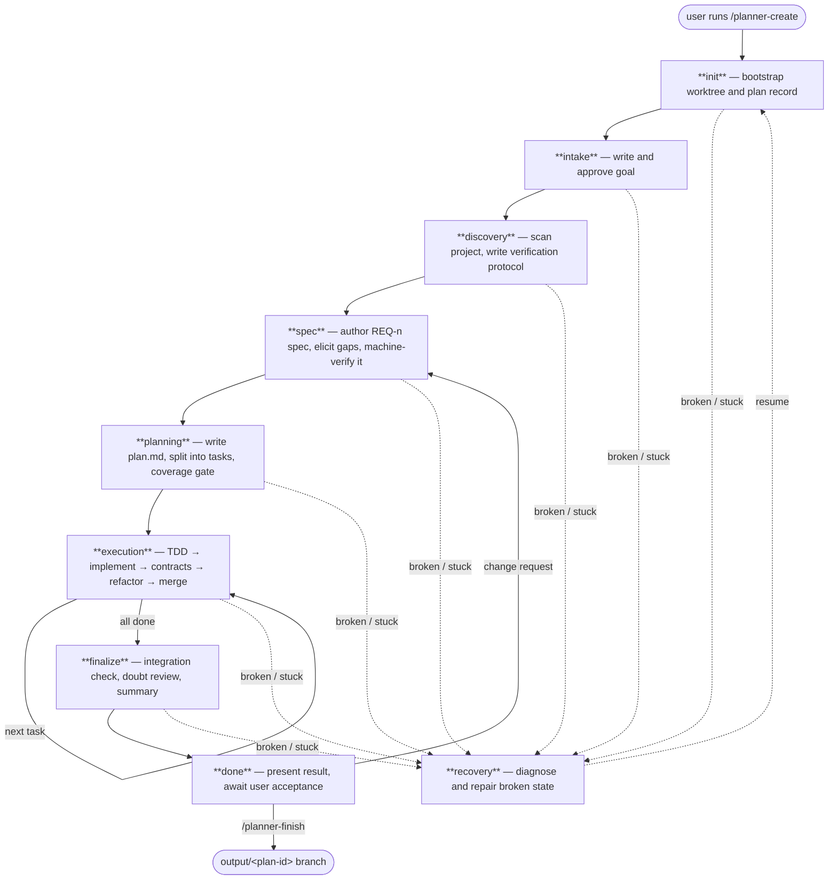

> ⚠️ Experimental. pi-code-planner is built **for local coding models** and, at runtime, is driven by one — a small local model (tested with Qwen3.6-35B-A3B-UD-Q4_K_XL.gguf) running through Pi. Cloud LLMs (such as Claude) take part in its development. It is maintained with AI assistance and may contain non-professional design choices, rough edges, broken behavior, or mistakes. Use it at your own risk.

# pi-code-planner

<p align="center">
  
</p>

An experimental [Pi](https://github.com/badlogic/pi-mono) extension for local coding models. Adds a persisted state machine so long tasks survive context compaction, Git branching, and user approval steps without babysitting the session.

> Not a guarantee of better output. In practice, a session implementing a nontrivial feature ran about 3 hours untouched. That is the goal.

---

## Install

Released versions, published to npm:

```bash
pi install npm:pi-code-planner
```

Developer version — the latest `main`, including changes not yet released to npm:

```bash
pi install git:github.com/m62624/pi-code-planner
```

Both channels can have bugs; the difference is only what they track — npm follows tagged releases, GitHub follows `main`. Pick npm for released versions and GitHub to try the newest changes.

Open Pi inside a Git project and run `/planner-create`.

> If `Shift+Enter` doesn't insert a new line, add `"tui.input.newLine": ["ctrl+j"]` to `~/.pi/agent/keybindings.json` and run `/reload`.

---

## How it works



**Runs on its own** through init, discovery, planning, execution, and finalize.

**Stops and waits for you** at two moments:
- **intake** — approves the goal before planning starts
- **done** — waits for `/planner-finish` or a correction

| Stage | Who drives it |
| --- | --- |
| init | Automated |
| intake | **You approve the goal** |
| discovery | Automated |
| spec | Automated, asks you when the verifier finds a gap |
| planning | Automated |
| execution | Automated (repeated per task) |
| finalize | Automated |
| done | **You run `/planner-finish`** |
| recovery | Automated, may ask before destructive repairs |

---

## Spec-driven development, verified by a SAT engine

pi-code-planner is not another prompt pipeline: the stochastic model is checked by a deterministic environment at every load-bearing step. The [elenchus](https://github.com/m62624/elenchus) engine (a three-valued SAT checker with an English-like DSL) is embedded as wasm, and three **hard gates** compile durable artifacts into logic programs — the model never hand-writes gate VRF, so it cannot fake or trivialize a check:

1. **Spec gate** (`spec` stage): after discovery the model authors `spec.json` — numbered `REQ-n` requirements with acceptance atoms, non-goals, machine-checkable constraints, and evidence-backed assumptions. A deterministic compiler turns it into VRF; the engine catches contradictions (CONFLICT), unaddressed requirements, and unestablished atoms — and every gap becomes a concrete question to you. Genuinely inexpressible requirements (taste, UX feel) exit through the *freedom valve*: deferred to human judgment with a recorded rationale, never force-formalized.
2. **Coverage gate** (`planning`): every task cites the `REQ-n` ids it discharges. `TOTAL … ON requirements` names every dropped requirement; `TOTAL … ON tasks` names every orphan task. The plan cannot enter execution while either list is non-empty.
3. **Test-coverage gate** (`execution`): each task carries a behavior board (`BHV-n`, `planned → red → green`). A behavior turns *red* only with a named failing test and *green* only after red — test-first enforced by data. The engine names every behavior still uncovered before the task may finish.

A verdict is bound to a sha256 of the artifact it was computed from: editing `spec.json`, a task's requirements, or the behavior board silently invalidates the pass. Plans created before this layer keep working — every gate degrades gracefully when the artifact does not exist.

---

## Settings

See [SETTINGS.md](SETTINGS.md) for the full reference.

**Idle watchdog** (`idle.timeoutMinutes`) — wakes the model when it goes silent mid-step.

The watchdog sends a wake-up message when the model has made no planner tool call for `timeoutMinutes`. This handles the common case where the model pauses mid-step — a long inference, a generation that produced prose instead of a tool call, or a context edge case. The wake message tells it to call `planner_status` and continue from the persisted state.

The right value depends on your model's inference speed. If the timeout is too short, the watchdog fires during normal generation and interrupts a step in progress. Too long, and a genuinely stuck model sits idle for a long time before recovery.

| Speed | Recommended |
| --- | --- |
| < 5 tok/s | `20` |
| 5–15 tok/s | `15` |
| 15–30 tok/s | `10` |
| > 30 tok/s | `6` |

> `timer.syncIntervalMinutes` is separate — it only controls how often the TUI clock saves telemetry, it does not wake the model.

---

## Commands

| Command | Purpose |
| --- | --- |
| `/planner-create` | Create a new plan from a request |
| `/planner-resume` | Resume an existing plan |
| `/planner-finish` | Export result, clean up state |
| `/planner-dashboard` | Open the live stage dashboard |
| `/planner-improve` | Discovery-first self-improvement plan |
| `/planner-skills` | Search and manage planner-generated skills |
| `/planner-exit` | Return to the original session without finishing |
| `/planner-delete` | Delete a plan |
| `/planner-rename` | Rename a plan |
| `/planner-helper` | Show current effective settings |

---

## Git Branches

```
base → plan/<plan-id> → task/<plan-id>/<task-id> → output/<plan-id>
```

Raw `git` is blocked while a plan is active. Use planner Git wrappers. Run tests from the worktree path reported by `planner_status`.

---

## Development

```bash
git clone https://github.com/m62624/pi-code-planner.git
cd pi-code-planner
npm install
npm run build
pi -e ./src/index.ts
```

---

## Why local, and why this exists

Notes out loud, not a pitch.

After a few months of running both cloud and local models day to day, one thing stuck with me: **the harness decides as much as the model does.** How work is framed, bounded, and fed in matters about as much as which model it is. I'm drawn to running things locally — a model on my own hardware — so I wrote this for myself, mostly to see how far my own model can carry real development work over long sessions. Pi is the base because it ships an SDK for exactly that kind of fine-grained control over the harness — a minimal core that doesn't bloat the context, and an extension API flexible enough to reshape the whole loop.

Why local, specifically? Mostly cost. Running everything through cloud models — across every class, from the cheap ones to the frontier — adds up fast, and a local model can claw some of that back on the right tasks. Cloud is clearly still ahead today, no illusions there; but I'm already trying to wire local agents into my own pet projects, and even when a lot of that gets refactored through Claude models afterwards, the local pass is interesting on its own. For small and mid-size tasks I use **[Qwen3.6-35B-A3B](https://huggingface.co/unsloth/Qwen3.6-35B-A3B-MTP-GGUF)** (the experiment here used only this model, the `Qwen3.6-35B-A3B-UD-Q4_K_XL.gguf` quant), context at **131k** for my hardware, roughly **30–40 t/s** depending on how full the window is. The output still isn't optimal — but I think hardware will get better at running MoE models at speeds comfortable for agentic work, and at that point leaving the simpler tasks to a small local model is an easy call. This is me getting ready for that.

It does **not** make the model smarter — nothing here adds reasoning. It adds boundaries and moves out of the model the parts a small model is worst at. The failure mode of a local model on a medium or large codebase is rarely a wrong line; it is loss of coherence over distance — facts that don't fit in the window together, drift across compaction, a decision contradicted ten steps later, "done" declared early. So each stage removes one degree of freedom:

- **Persisted state** — plan, tasks, decisions, and the current step live on disk, not in chat; they survive compaction and are reconstructed via `planner_status`.
- **Forced order** — no implementation before discovery, no production code before tests, no "done" with pending tasks; a guard holds a model that "feels finished" to the protocol.
- **Per-task Git isolation** — one task, one branch, one merge; a bad task is contained instead of smearing across the change.
- **Local contracts (AGENTS.md)** — scope is pinned to the relevant directory chain instead of guessed.
- **Mechanical consistency ([elenchus](https://github.com/m62624/elenchus))** — the model states only facts and first principles in a tiny DSL; a wasm SAT engine does the inference and reports `CONSISTENT / WARNING / UNDERDETERMINED / CONFLICT` with the premises to blame, so the model can only be wrong at the premise level and that is caught immediately. It is a soft gate with a `not_applicable` escape, so it never traps simple work.

The honest part, kept short: a local model is still a local model, and the project itself is largely vibe-coded — so expect rough edges, bugs, and instability, and be ready for them. A small model can't infer hidden requirements on its own — it wants everything explicit rather than implied, and the more detailed the plan, the better the result. Even at its best, its ceiling today still sits below the cloud models. It helps; it doesn't guarantee anything.

## License

[MIT](https://github.com/m62624/pi-code-planner/blob/main/LICENSE)
